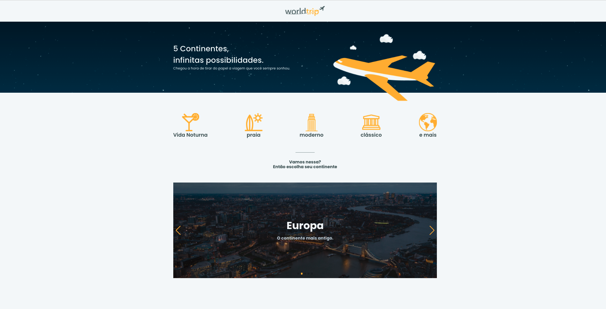
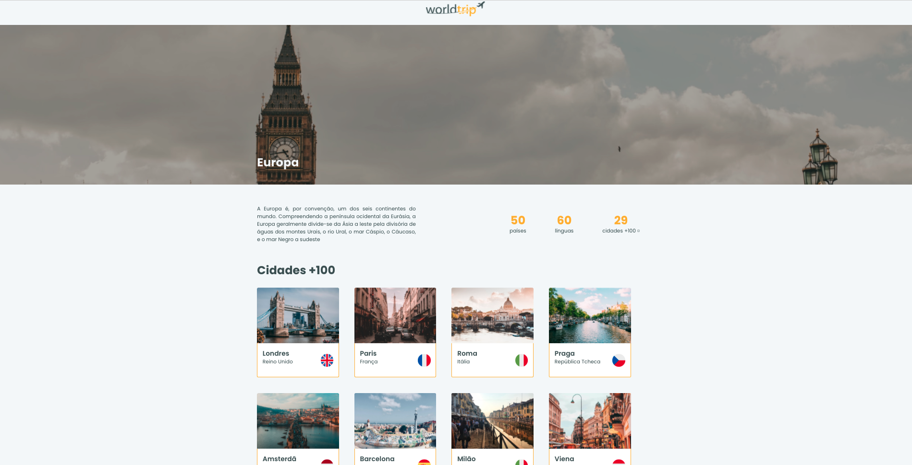
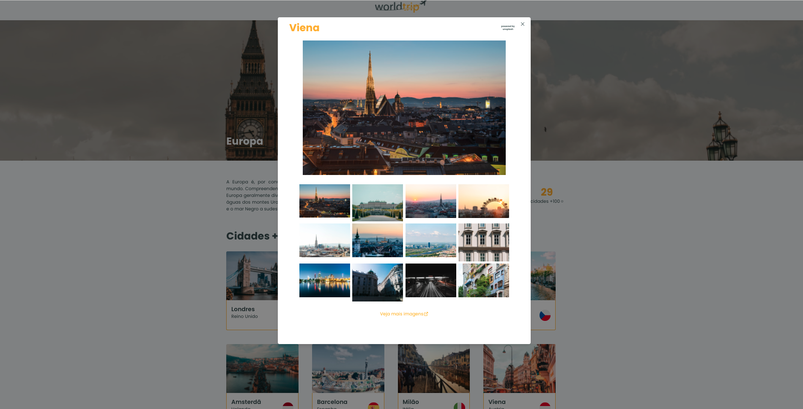

# Word Trip

Application developed to practice NextJS with SSG. In this application, you can know what are the most 100 visited countries around the world, and see Photos got from Unsplash API.

Developed in the ignite course by rocketseat .

### How to run

## instal dependencies

```bash
yarn
```

## run develop

```bash
yarn dev
```

## build and start

```bash
yarn build
yarn start
```

### Images




